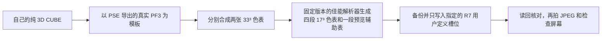

# Canon LUT Lab

将纯 3D `.cube` LUT 转成 Canon EOS R7 可选用的自定义照片风格，让效果进入机身实时预览与 JPEG。这个仓库公开的是**实测方法和代码**，不包含相机固件、佳能软件、第三方 LUT、设备数据或私人照片。

> 实测范围：一台 EOS R7，固件 1.0.1；Mac 上 EOS Utility 3.20.21.3、Picture Style Editor 1.32.20，以及对应的 EdsCFParse。其他版本和机型需要重新验证。R5 与 R7 都能使用官方照片风格，并不代表这里的底层数据格式相同。

## 先看结果

| 环节 | 本次 R7 结果 | 能证明什么 |
|---|---|---|
| `.cube` → 原生风格载荷 | 多个 33³ LUT 完成 | 离线转换与编译可运行 |
| 写入自定义槽位 | 写入后逐字节读回一致 | 设备接受这份数据 |
| 实时预览 + 机内 JPEG | 红蓝交换诊断通过；富士 NC、Kinetic 02 等完成实拍 | 实际色表进入拍摄链路 |
| 富士 NC 固定场景 | 中性／NC／中性三张对照，预期与直出误差接近重复拍摄波动 | 那个场景里适配后的 LUT 与直出相符 |
| 富士 NC 重启检查 | 用户确认预览与回放正常 | 当次断线后保留 |

Kinetic 02 等普通 LUT 的效果依赖输入画面。源文件声明 Rec.709 时，通常适合从显示编码 RGB 开始测试；Log LUT 需要先匹配输入色彩空间。Canon 中性照片风格与任何其他厂商的基础风格并不相同。这里不宣称逐色复刻原厂机身、完整替换固件或让 R7 直接浏览卡上的 CUBE。

## 这条路线做了什么

普通 PSE 打开并再次保存这类修改过色表的 PF3，会重新生成中性色表。真正写入机身的是离线编译后的 **83076 字节照片风格载荷**，不是把 `.cube` 改扩展名，也不是固件升级。预览辅助表缺失时，曾出现 JPEG 变色、实时取景不变的现象。研究过程和数据边界见 [原理记录](docs/HOW_IT_WORKS.md)。

## 想在自己的 R7 上复现

请从 [安装与操作指南](docs/SETUP_ZH.md) 开始。流程会先用佳能官方软件在目标槽位注册一份正常的 PSE 文件，再读取**自己机身**的模板数据，离线编译自己的 LUT，最后单槽写入并核对。每个步骤都有明确的检查点；工具不自带第三方资料。只支持本次固定的解析器版本和 R7 载荷布局，版本不符会停止。

先用自己生成的红蓝交换或恒等诊断 LUT 检查路径，再用创意 LUT。测试时固定构图、曝光、白平衡，对比机身 JPEG 与取景；从相机卡读取原片，避免把电脑后期套色的图片误认为直出。

## 目录

| 路径 | 内容 |
|---|---|
| `core.js` | CUBE 解析、插值、33³ 重采样；不访问相机 |
| `src/cfp_bridge.py` | 用本机合法安装的 PSE 模板生成中间 PF3 |
| `src/compile_r7_dense.py` | 本机固定 EdsCFParse ABI 的离线编译器 |
| `src/eds_snapshot.m` | 只读快照：机型描述和当前三个槽位 |
| `src/eds_install_one.m` | 只替换一个槽位，先备份，后读回，失败时尝试恢复 |
| `build_macos.sh` | 在本机编译两个辅助程序 |
| `compare_lut_pair.py` | 可选的原始 JPEG / LUT 数值对照工具 |
| `docs/` | 安装、逆向记录、验证、恢复与输入色彩空间 |

## 边界与公开内容

本仓库不提供可直接刷入任意相机的载荷。`local/` 保存从自己相机读取的数据、PF3 模板、CUBE、编译结果和备份，并被 Git 忽略。请自行从佳能官网下载软件，确认你持有 LUT 的使用权。Canon、FUJIFILM、Panasonic、Gamut 等名称属于各自权利人；项目与其无隶属关系。

源代码以 MIT 许可发布；许可只覆盖本仓库作者提供的代码与文档，不覆盖外部软件、文件和商标。研究代码会使用未公开的 SDK 符号，可能随厂商更新失效。遇到不匹配时保持停止状态，再针对新版本验证。

## 参与

欢迎提交不同机身或版本的**脱敏验证报告**，请勿上传机身描述符、注册载荷、第三方 LUT、照片、序列号或安装包。见 [贡献指南](CONTRIBUTING.md)。

[English summary](docs/ENGLISH.md) · [版本记录](CHANGELOG.md)
